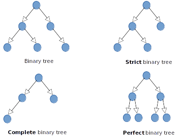
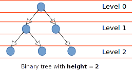
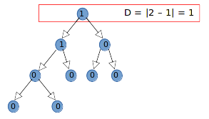
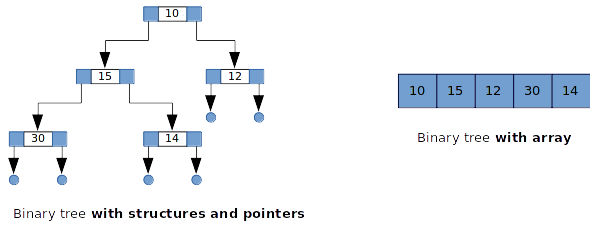
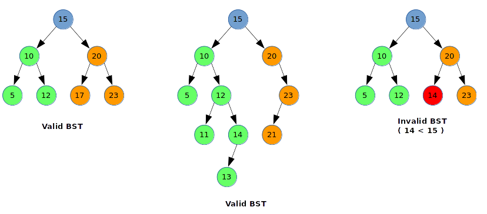
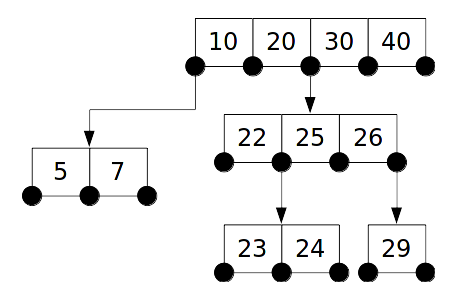

[](https://travis-ci.org/jean553/c-data-structures)

# c-data-structures

Attempt to implement common data structures in C.

## Table of content

 - [Lists](#lists)
    * [Linked list](#linked-list)
    * [Double linked list](#double-linked-list)
    * [Self organizing list](#self-organizing-list)
    * [Unrolled linked list](#unrolled-linked-list)
    * [XOR Double linked list](#xor-double-linked-list)
    * [Circulat linked list](#circular-linked-list)
    * [Skip list](#skip-list)
 - [Trees](#trees)
    * [Binary tree](#binary-tree)
    * [Binary Search Tree](#binary-search-tree)
    * [Red black tree](#red-black-tree)
    * [B-Tree](#b-tree)
 - [Tries](#tries)
    * [Trie](#trie)
 - [Others](#others)
    * [Vector](#vector)
    * [Hashmap](#hashmap)
    * [Set](#set)

## Requirements

### Ubuntu/Debian

```bash
apt-get install gcc cmake check
```

### Archlinux

```bash
pacman -S gcc cmake check
```

## Compilation

```bash
mkdir build && cd build/
cmake ..
make
```

## Tests execution

```bash
ctest --output-on-failure .
```

## Create individual libraries

In the example below, we create a library for the linked list.

```bash
cd linked_list/
gcc -c -fpic linked_list.c
gcc -shared -o liblinkedlist.so linked_list.o
```

Export the path for dynamic imports:

```bash
export LD_LIBRARY_PATH={directory of your *.so file}
```

## Documentation

### Installation

#### Ubuntu/Debian

```bash
apt-get install doxygen
```

#### ArchLinux

```bash
pacman -S doxygen
```

### Documentation

```bash
doxygen
```

# List of data structures

## Lists

NOTE: the following data structures have not been created in this project:
 * `tuples`: finite ordered list of items that can have different types, accessed by index or key, they are `structures` in C,
 * `fixed array`: finite ordered list of items that have the same type, accessed by index, they are `arrays` in C.

### Linked list

Each node contains the data itself and a pointer to the next node.

```
+-----------+-----------+          +-----------+-----------+           +-----------+-----------+
|           |           |          |           |           |           |           |           |
|   Data    |  Pointer  +--------> |   Data    |  Pointer  +---------> |   Data    |  Pointer  +------>  NULL
|           |           |          |           |           |           |           |           |
+-----------+-----------+          +-----------+-----------+           +-----------+-----------+
```

The implemented methods are:
 * create
 * insertAtTheEnd
 * insertAtTheBeginning
 * at
 * size
 * all
 * insertAfter
 * dropAt
 * dropAtTheEnd

Pros:
 * The size is not fixed
 * Fast read and write operations with small lists
 * Inserting and removing don't require data copy

Cons:
 * slow read and write operations with long lists ( O(n) )

Time complexity:
 - Average:
    * Access: O(n) (all the items must be browsed until it reaches the indexed one)
    * Search: O(n) (all the items must be browsed until it finds the researched one)
    * Insertion: O(1) (insertion only concerns the inserted node and does not move the others)
    * Deletion: O(1) (deletion only concerns the deleted node and does not move the others)
 - Worst:
    * Access: O(n) (all the items must be browsed until it finds the indexed one)
    * Search: O(n) (all the items must be browsed until it finds the researched one)
    * Insertion: O(1) (insertion only concerns the inserted node and does not move the others)
    * Deletion: O(1) (deletion only concerns the deleted node and does not move the others)

Space complexity: O(n)

### Double linked list

Each node contains the data itself and two pointers.
The first one is pointing to the previous node,
the second one is pointing to the next node.

P : Previous
D : Data
N : Next

```
    +-----------------+      +-----------------+      +-----------------+
    |     |     |     |      |     |     |     |      |     |     |     |
 <--+  P  |  D  |  N  +--->  |  P  |  D  |  N  |  <---+  P  |  D  |  N  +-->
    |     |     |     |      |     |     |     |      |     |     |     |
    +-----------------+      +-----------------+      +-----------------+
              ^                 |           |                 ^
              +-----------------+           +-----------------+
```

The implemented methods are:
 * create
 * insertAtTheEnd
 * insertAtTheBeginning
 * insertAfter
 * at
 * size
 * all

Pros:
 * the size is not fixed
 * can be browsed in both directions
 * inserting and removing don't require data copy

Cons:
 * takes more space than a simple linked list

Time complexity:
 - Average:
    * Access: O(n) (all the items must be browsed until it reaches the indexed one, time can be improved according to which side is selected to start browsing if the position of the indexed item is estimated first),
    * Search: O(n) (all the items must be browsed until it founds the indexed one, time can be improved according to which side is selected to start browsing if the position of the indexed item is estimated first),
    * Insertion: O(1) (insertion only concerns the inserted node and does not move the others)
    * Deletion: O(1) (insertion only concerns the inserted node and does not move the others)
 - Worst:
    * Access: O(n) (all the items must be browsed)
    * Search: O(n) (all the items must be browsed)
    * Insertion: O(1) (insertion only concerns the inserted node and does not move the others)
    * Deletion: O(1) (insertion only concerns the inserted node and does not move the others)

Space complexity: O(n)

### Self organizing list

A simple linked list that automatically updates its nodes order.
The order is updated according to the frequency of nodes calls.

The implemented methods are:
 * atWithMTF - like at() and applies `Move To Front` method
 * atTranspose - like at() and applies `Swapping` method

#### Move To Front

Everytime a node is requested, the node is moved to the head of the list.

Pros:
 * no additional data into the linked list (standard linked list can be used)

Cons:
 * not accurate: simply moves to the top every requested node,
the algorithm does not include any average consideration of nodes usage.

#### Swapping method

Everytime a node is requested, the selected node is swapped with the previous one.

Pros:
 * accurate compared to the MTF method, nodes move according to how they are requested and they move progressively to the head

Cons:
 * takes many accesses to move one node to the head

### Unrolled linked list

```
        +--------------------------------+
        | +----------------------------+ |
        | |    ||    ||    ||    ||    | |
        | | 0  || 1  || 2  || 3  || 4  | +----+
        | +----------------------------+ |    |
        +--------------------------------+    |
                                              |
  +-------------------------------------------+
  |
  |     +--------------------------------+
  |     | +----------------------------+ |
  |     | |    ||    ||    ||    ||    | |
  +---> | | 5  || 6  || 7  || 8  || 9  | +-->  NULL
        | +----------------------------+ |
        +--------------------------------+
```

The unrolled linked list is a linked list that contains arrays.
All the arrays have the same size, this size is set during the list creation.

Implemented methods:
 * createULL
 * atULL
 * insertAtTheEndULL

Pros:
 * search an item by index can be faster because the last browsing step
is performed by array indexing,

Cons:
 * insertions in the middle are expensives

### XOR Double linked list

A double linked list that only uses one pointer per node to go to the previous or next node.
A bitwise XOR operation is applied on the node address field when inserting and reading;
by this way, the list can find the next or previous node.

```
+---------+  +---------+  +---------+  +---------+
|    a    |  |    b    |  |    c    |  |    d    |
+---------+  +---------+  +---------+  +---------+
| b XOR 0 |  | a XOR c |  | b XOR d |  | c XOR 0 |
+---------+  +---------+  +---------+  +---------+

+------------------------------------------------>

<------------------------------------------------+
```

Implemented methods:
 * create
 * insert
 * at

### Circular linked list

The circular linked list is a linked list without head and tail.
The last node simply points to the first one.

```
+----+        +----+        +----+
| 10 +----->  | 20 +------> | 30 |
+-+--+        +----+        +--+-+
  ^                            |
  |                            |
  +----------------------------+
```

Implemented methods:
 * create
 * insertAtTheEnd
 * insertAtTheBeginning
 * at

NOTE: In such kind of list, at(5) in the list [1,2,3,4] returns 2.

### Skip list

```
 +------+  +-------+                                +-----+
 | head |  |level 3+------------------------------> |  7  +------------------------------>  NULL
 +------+  +-------+                                +-----+
               |                                       |
               v                                       v

           +-------+                                +-----+                   +-----+
           |level 2+------------------------------> |  7  +-----------------> |  9  +---->  NULL
           +-------+                                +-----+                   +-----+
               |                                       |                         |
               v                                       v                         v

           +-------+                   +-----+      +-----+                   +-----+
           |level 1+-----------------> |  6  +----> |  7  +-----------------> |  9  +---->  NULL
           +-------+                   +-----+      +-----+                   +-----+
               |                          |            |
               v                          v            v                         v

           +-------+      +-----+      +-----+      +-----+      +-----+      +-----+
           |level 0+----> |  4  +----> |  6  +----> |  7  +----> |  8  +----> |  9  +---->  NULL
           +---+---+      +--+--+      +--+--+      +--+--+      +--+--+      +--+--+
               |             |            |            |            |            |
               v             v            v            v            v            v
             NULL           NULL         NULL         NULL         NULL
```

The skip list provides different lanes of nodes to access data quicly.
On each lane, every nodes are ordered by key. Every node points on one data item.
The nodes with the same key point to the same data item.

Implemented methods:
 * create
 * insert
 * at
 * all

## Trees

### Binary tree

The binary tree is a tree in which one every node has at most two children.

A `strict` binary tree has every nodes with exactly zero or two children.
A `complete` binary tree has every level fullfilled (the last one may not be fullfilled),
and all nodes are as left as possible.
A `perfect` binary tree has every level filled.



The `root` node is the top node of the tree. A `leaf` node is a node on the last level of the tree.
The `height of a binary tree` is the number of node(s) between the root node to any one of the leaf node.



Find N the maximum nodes amount of a binary tree with a height of H:
`N = 2^(H+1) - 1`

Find H the height of a binary tree of N nodes:
`H = log2(N+1) - 1`

Find H the minimum height of a binary tree of N nodes:
`H = log2(N)`

Find H the maximum height of a binary tree of N nodes:
`H = N - 1`


Most of the time, we always want to keep the binary tree with a height as small as possible;
we call that kind of tree a `balanced` tree.

A binary tree is `balanced` when the difference between the height of the left sub-tree and
the height of the right sub-tree is equal to 0 or 1.

The difference D between two sub-nodes of a given node can be calculated
with the height HL of the left sub-node and the height HR of the right sub-node:
`D = |HL - HR|`



In a perfect tree, the difference of every node is 0.

In programming, a binary tree can be built with `pointers` or with an `array`.

Access the left item N of the node I in a binary tree stored as an array:
`N = I * 2 + 1`

Access the right item N of the node I in a binary tree stored as an array:
`N = I * 2 + 2`



### Binary Search Tree

The binary search tree is a binary tree. In a binary search tree, the values
of all the nodes in the left sub-tree are lesser than or equal to the current node value,
and the values of all nodes in the right sub-tree are greater than the current node value.
The binary search tree is an ordered binary tree.

Binary search trees are used to access data faster (read and write)
than basic binary tree.

For example, let's considere a list of 1 million items (10^6).
Let's considere that the computer that has to find one item in this list
is able to make one comparison process in 10^-5 seconds.
The computer has to compare the searched value with every value of the list.
It would take 10 seconds maximum to find the result.
The binary search tree is a solution to this "long time search" problem.



Binary search trees make `Binary search` possible: when binary search is applied,
a specific value is searched. This searched value is compared to the root node value;
if the searched value is lesser than or equal to the root node value,
the search goes to the left sub-tree and the same operation is performed;
if the searched value is greater than the root node value,
the search goes to the right sub-tree and the same operation is performed.


In the best case, we need `log2(n)` steps to find an item in a binary search tree
(where `n` is the total amount of items). This is the case for balanced binary search tree.

In the worst case, we need `n` steps to find an item in a binary search tree
(for exemple, the last item of a linked list, which is not balanced binary search tree even if it is ordered).

Implemented methods:
 * create
 * insert
 * search
 * removeAt

### Red black tree

The red black tree is a binary search tree that ensures self-balancing during insertion.
In fact, one of the binary search tree main problem is that it can be a simple linked list
(according how the insertions have been done).
Using a balanced tree, the access time can decrease.

The red black tree node is the same as the BST node with one more parameter called the "color".
The color is an attribute of every node that can be `Black` or `Red`.
The nodes are inserted into the tree the same way as a standard BST;
right after insertion, a "self-balancing" procedure is performed;
During this process, the color of one or many nodes may change in order to respect a set of rules.
This set of rules ensure that the tree stays balanced.

These rules are:
 * the root node is always black,
 * the leaf nodes of the tree are always black (or Null),
 * every red node always have exactly two black children,
 * all paths from one node to a leaf node have the same amount of black nodes
Note that a NULL node of any other node is considered as black.

The self-balancing process simply tries to detect some violations of these rules right after a node insertion.
Those violations are recurrent and the solutions to fix them are predefined.

#### Implemented tests

Tests have been implemented for the following violations (in order in the tests file):

First violation tests (`tests_red_black_tree_first_violation`):

 * red parent (left child) and red uncle (right child), black root node, the current node (left child) should be black
 * red parent (left child) and red uncle (right child), black root node, the current node (right child) should be black
 * red parent (right child) and red uncle (left child), black root node, the current node (left child) should be black
 * red parent (right child) and red uncle (left child), black root node, the current node (right child) should be black

Second violation tests (`tests_red_black_tree_second_violation`):

 * black grand parent (left child) and red parent (left child), no others
 * black grand parent (right child) and red parent (right child), no others

First and second violation tests (`tests_red_black_tree_first_and_second_violation`):

 * first violation and second violation by adding only right children
 * first violation and second violation by adding only left children
 * first violation and second violation by adding only three left children
 * red parent (left child) and black uncle (right child), black root node, the current node is a red right child
 * red parent (right child) and black uncle (left child), black root node, the current node is a red left child

### B-tree



A B-Tree can also be called a #-# B-Tree according to its amount of keys and children.
For example, a B-Tree with two keys and three children per node is a `2-3 B-Tree`,
a B-Tree with four keys and five children per node is a `4-5 B-Tree`.

Each B-Tree node is a list of items. Each item contains a key and two links to another B-Tree node.
Optionaly, each item contains some data linked to the key.

Implemented methods:
 * create
 * insert
 * search

*NOTE*: with the current implementation, the B-tree is not automatically balanced.

## Tries

### Trie

A trie is a structure in which one every node does not have its own key;
instead, the key is part of the node and its parents keys.


The trie above contains the following words:
 * hi,
 * hell,
 * hello,
 * be,
 * bee,
 * is,
 * idiom,
 * idea

The blue circles indicate the end of one of these words.

This trie can be used for two use cases:
 * search words from a dictionary (we simply have to browse the trie character by character to know if a word exists),
 * key/value storage where every node contains data or a pointer to the data; in that case, every node can have a key even if it is not a valid word (ex: h, he, hel, b, ide, idi, idio)

The implemented methods are:
 * create
 * keyExists
 * insert

During insertion and creation, a whole string is given as parameter and inserted into the trie.
During searching, a whole string is given and used to browse the trie.

In order to store the trie into memory and being able to browse it,
every trie node stores a pointer to a linked list node that contains all its children
(every linked list node contains a pointer to a child).

## Others

### Vector

An array is a set of continuous data in memory.
A vector is a dynamic array (the allocated size can vary).

The meta-data about the vector is fixed-size and allocated on the stack.
It contains a pointer to the data itself, the capacity of the vector
and the current length of the data.
The data array itself is allocated on the heap and is contiguous.

The implemented methods are:
 * create
 * insertAtTheEnd
 * insertAt
 * updateAt
 * at
 * size

Pros:
 * fast read and write operations, because we use a pointer to directly jump at the expected index

Cons:
 * the size is fixed because memory has to be allocated once in order to ensure that all the nodes are grouped together in memory;
 * insert when the array is full requires to reallocate memory (the whole array content might be copied)
 * insert into the array requires to copy (shift) many nodes

### Hashmap

A hashmap is a map that stores data with unique key/value pairs.
When inserting data into the hashmap, a hash of the key is generated;
this hash is the 'address' of the data, used for future updates and searches.

```


                                                          +------------------+
                                                          | 55  |            |
                                                          +------------------+
  {'key1':'value1'}  +--->   hash('key1') = 56   +----->  | 56  |   value1   |
                                                          +------------------+
                                                          | 57  |            |
                                                          +----------------------------------+
  {'key2':'value2'}  +--->   hash('key2') = 58   +----->  | 58  |   value 2  |     value3    |
                                                    |     +----------------------------------+
                                                    |
                                                    |                   ^               ^
  {'key3':'value3'}  +--->   hash('key3') = 58   +--+                   |               |
                                                                        |               |
                                                                        +---------------+
                                                                                |
                                                                                |
                                                                               ++
                                                                           Compare keys
                                                                           if collision

```

Insertion steps:
 * data is inserted using a key/value pair,
 * a hash of the key is generated by a common hash function,
 * the value is inserted at the hash address in the array (the key is inserted with its value),
 * if many keys have the same hash (collision), the new node is inserted just after the others (linked list),
 * both of the key and the hash method are used to find data (the keys of the same linked list are browsed if many nodes have the same hash)

Implemented methods:
 * create
 * insert
 * at

### Set

A set is an array of unique keys (a standart set usually only contains keys, instead of some sets implementations, like C++ std::multi_set, that store keys and values). The order of the keys
usually depends of how the set has been implemented.

In fact, a set can be implemented using:
 * trees (binary search tree, red-black tree...), in that case, the order depends of how the tree organizes items and move them during self-balancing operations (std::set in C++),
 * hashmap, in that case, the order is not predictable at all (std::unordered_set in C++),

That's why the "order" is something that does not matter when storing stuffs to a set.

There is no set implementation in this project. Instead, there are trees and hashmap implementations.
